# Orion

Name a city. An AI crew plans your days on real streets, then a magic goose flies you through them in photorealistic 3D.

[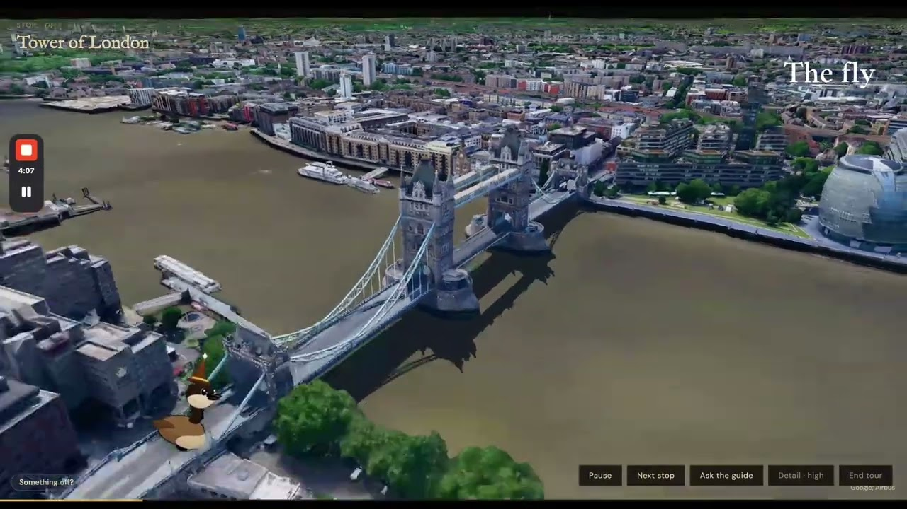](https://youtu.be/1InwD73Dmjo)

[Watch the demo](https://youtu.be/1InwD73Dmjo) · [Try it live](https://orion-coral.vercel.app) · [Meta Quest](quest/README.md)

Planning a trip takes a few minutes, so if you're in a hurry, open a trip that's already on the shelf and fly that one.

## Inspiration

Trip planning is annoying in one of two ways. You either spend a whole evening building an itinerary and still have no idea what the day will feel like, or you don't bother and just wing it when you land.

Asking a chatbot doesn't really help. It often doesn't come up with feasible plans and isn't grounded in the real world. It can give you a list of places to visit, but it doesn't help you understand how they connect, what the route actually looks like, or what you'll experience along the way.

We wanted the plan to be something you could trust, and then something you could go look at before you leave. So we built a crew that plans it and an AI goose guide that flies you through it.

## What it does

Tell Orion what kind of trip you want and hit go.

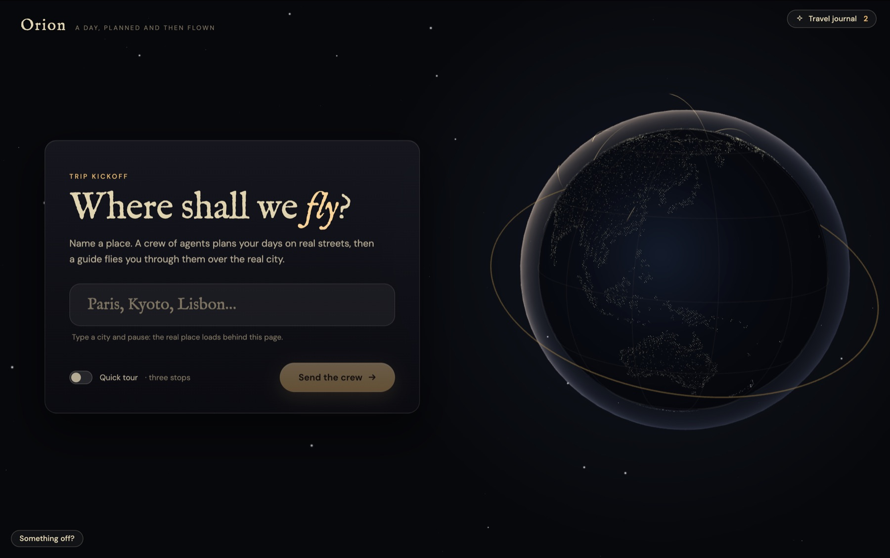

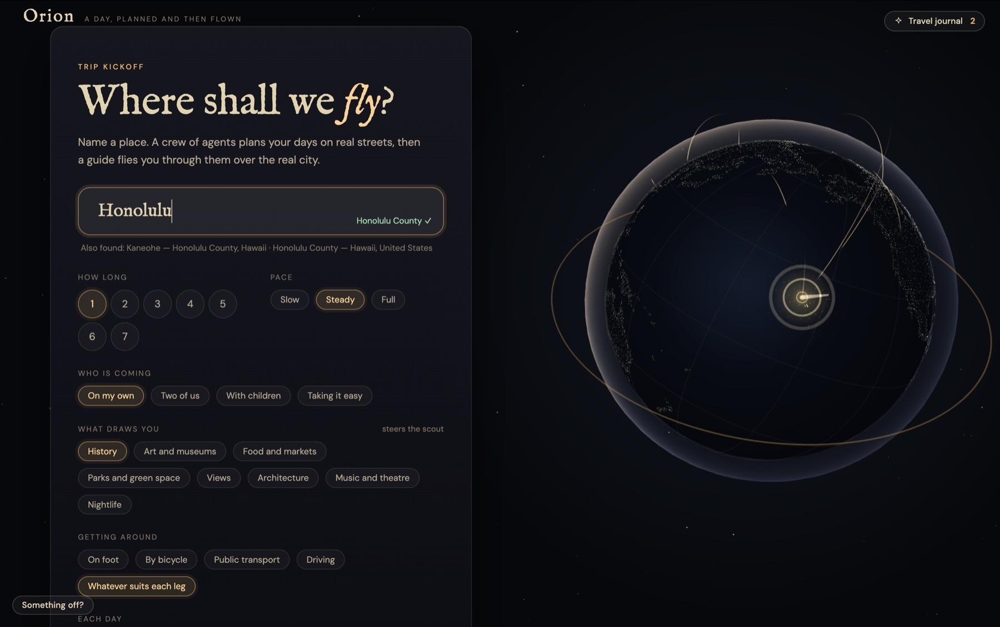

A small crew of agents + tools pops up and gets to work: one finds places, one checks how long it takes to get between them, one keeps the schedule honest, one complains when a pick is bad and sends it back.

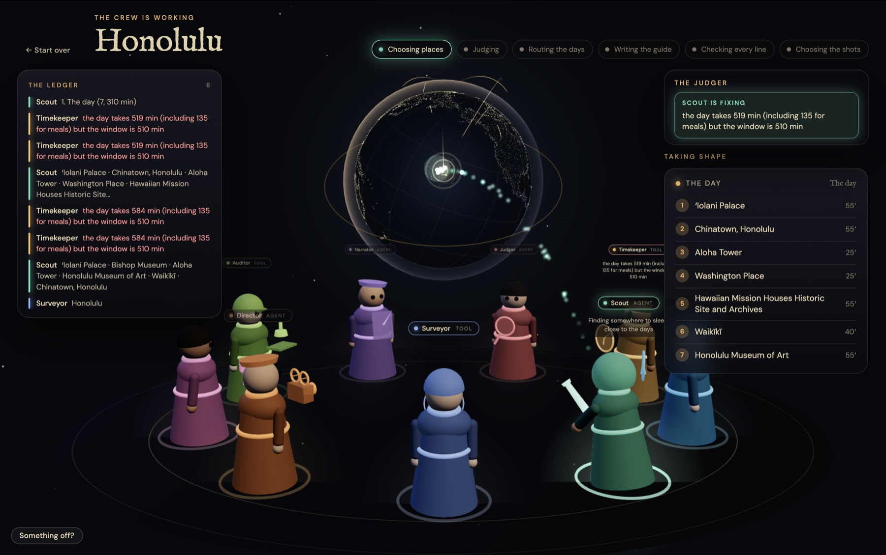

If you don't like something, type that in ("drop the museum, slower morning") and it replans the day. Once you're happy with the plan, you lift off into a photorealistic 3D flight over the actual city while following the planned route.

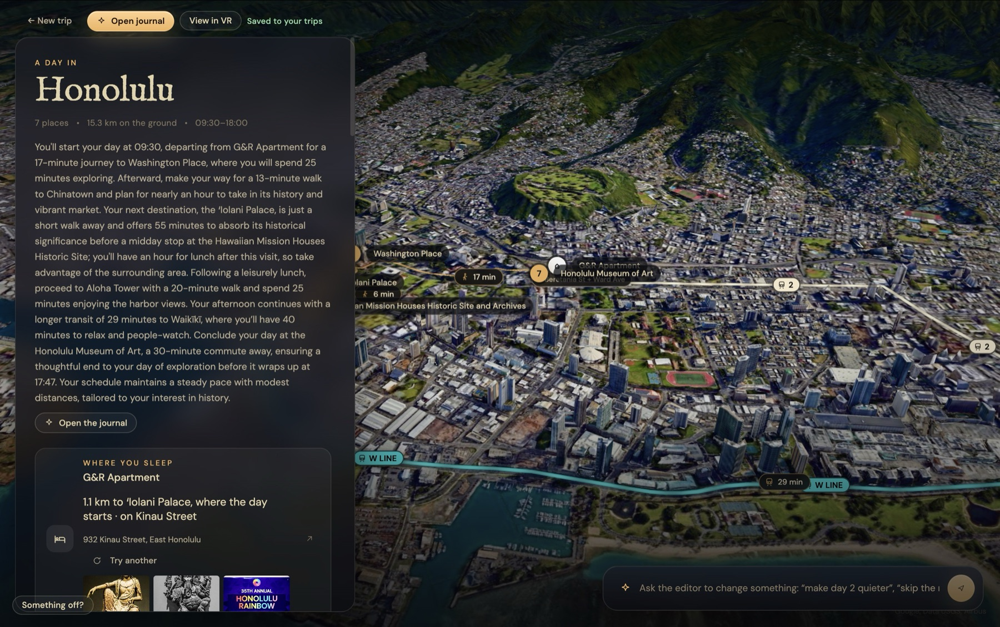


Your guide is a small magic goose. It talks you through each stop, and you can interrupt it with your voice to ask about what you're looking at.


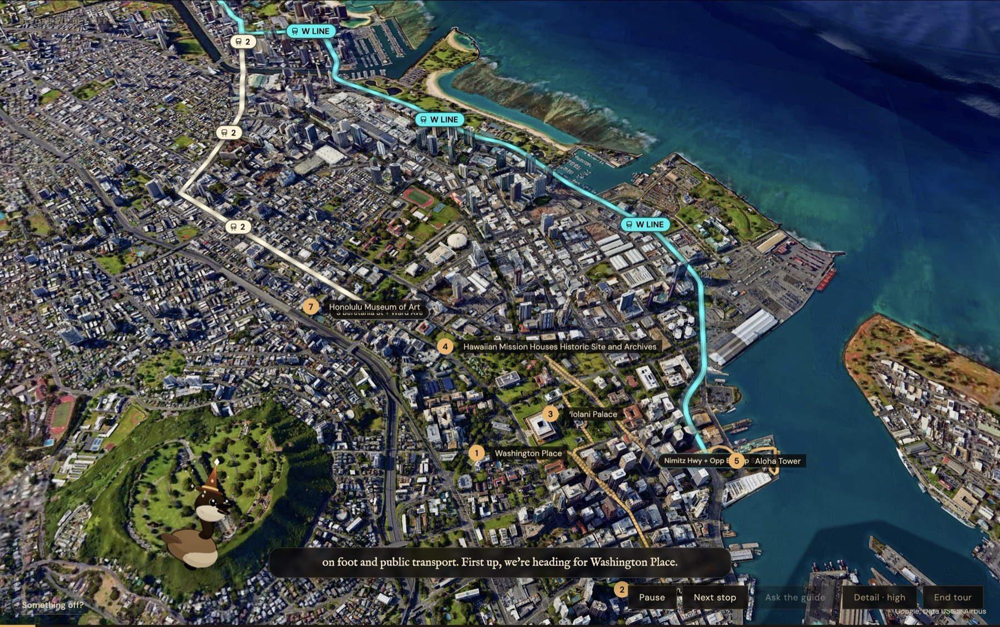

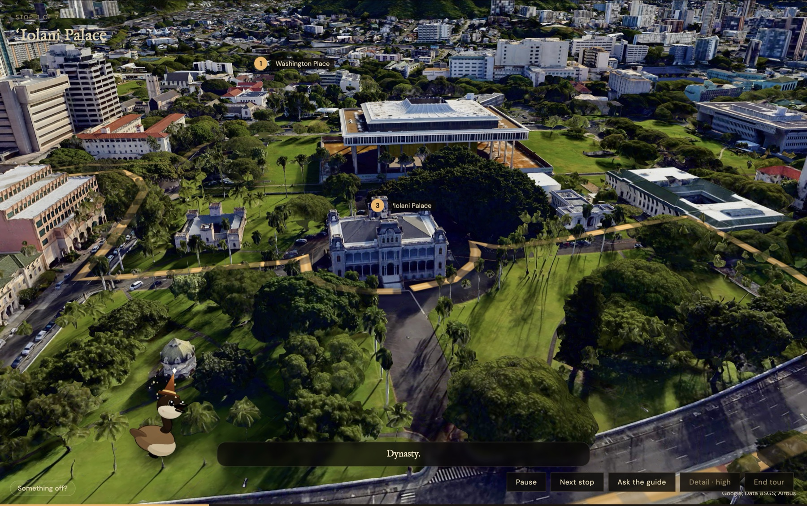

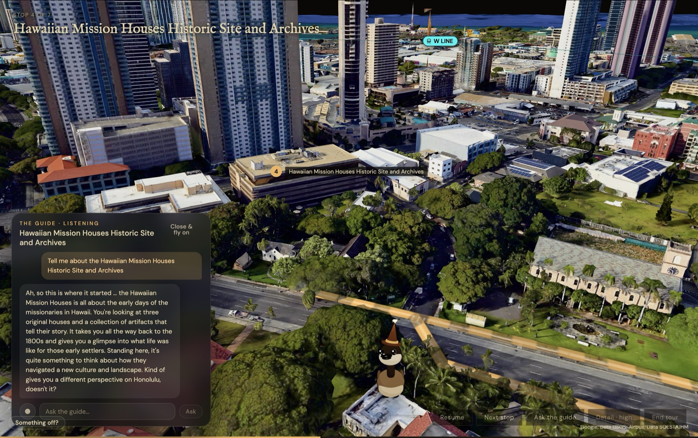

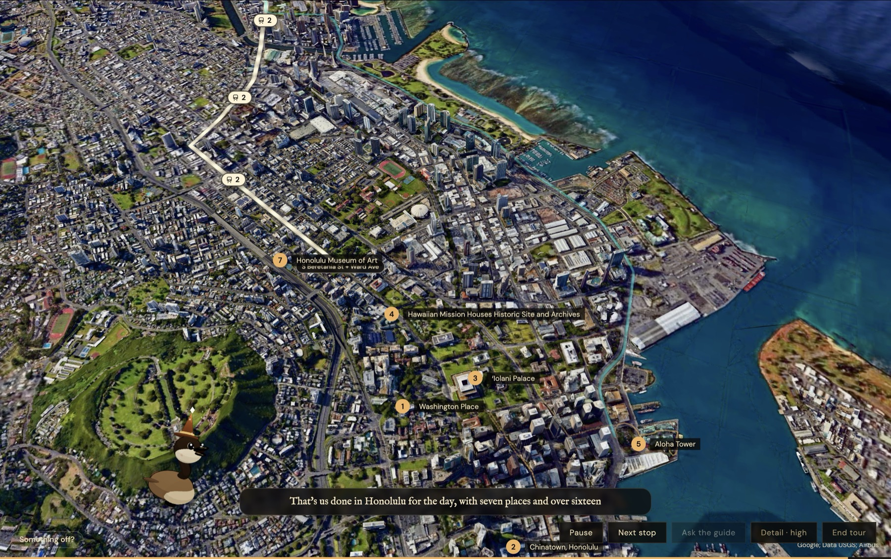

As a plus, you also get an exportable travel journal that looks hand-drawn, with routes, arrival times, food, and a place to sleep.

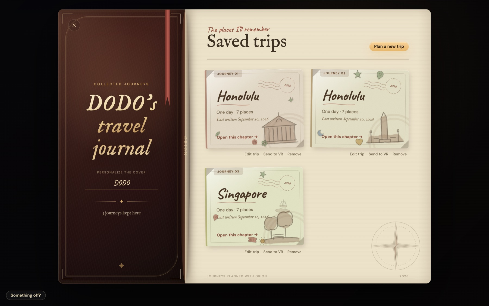

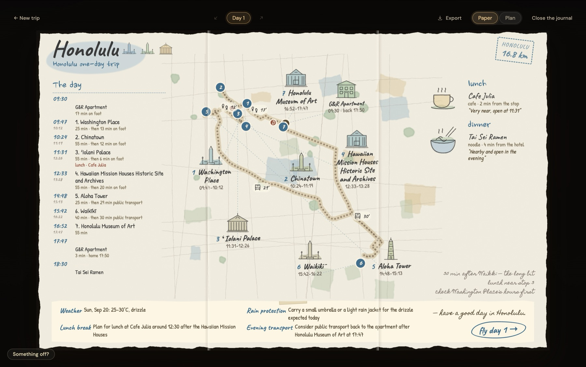

## The crew

There are 8 crew members. 4 are LLM agents (Scout, Judger, Narrator, Director), 3 are plain code (the Surveyor geocodes, the Router calls Google Routes, the Timekeeper does the schedule math), and the Voice is ElevenLabs. The UI labels which is which. All timing and routing are done in code so the models never have to do math or generate unrealistic routes.

The system works as a pipeline with a critic loop inside it. The agents don't choose their own tools.

- The Timekeeper checks the schedule first. If the plan fits within a day, the Judger (our LLM critic) reviews the picks. Each complaint says which crew member has to fix it, and it gets pasted into that agent's next prompt.
- Every place the Scout suggests gets looked up on Wikipedia. It has to be an actual article with coordinates inside the city or we discard it.
- The Director picks camera angles using GPT-4o vision. For each narration line we render 6 angles of the place from the 3D scene and send them together with the sentence the goose is about to say. If the thing can't be seen from any angle, we cut the line.
- When you interrupt the goose it gets the stop you're at, the sentence it was in the middle of, what's still coming up, and the last 12 turns of conversation.

## How we built it

**The world.** Google Photorealistic 3D Tiles for the city, Google Routes for distances and transit, Wikipedia and OpenStreetMap for facts, food, and places to stay.

**The crew.** OpenAI API + Codex. GPT-5.6 Luna and 4o through Chat Completions API. There are 14 prompts, and each job has its own token budget. We validate the response JSON in code, and if a reply gets cut off for length we retry once with 3x the budget. Codex pair-programmed the flight's narration: it preloads every voice clip before takeoff and holds the camera until the guide finishes each line. It also built the subtitle-style captions that follow the audio's real playback position.

**The voice.** ElevenLabs. The goose is Eleven v3. The guide writes audio tags like `[amused]` and `[whispers]` into its answers, and there are 8 moods that each map to different stability and style settings. To make the voice sound like a goose, we generate the line slower and then play it back faster by the same amount, so the pitch goes up but the pace sounds normal. Narration gets voiced while the plan is still being written, and in the flight the camera is timed off the audio, so it waits for the goose to finish a sentence before it moves.

**The memory.** MongoDB Atlas. A trip is one big nested object (days, stops, narration lines, routes, camera choices) and we always load and save the whole thing, so it's one document. We also use Atlas to get a trip onto the headset. "Send to VR" writes one small document and the Quest reads it. A plan made today opens again next week, on the web or in the headset, with the same audio.

**The eyes.** Sentry. On the web app and the server, each planning stage is a transaction and each agent or tool call is a span, using Sentry's `gen_ai` conventions. Every model call has the agent's name, the model, how long it took, and its token counts, so we can see what each crew member costs. The flight is its own transaction with average fps, long frames, and how long tiles took to load. Session Replay records the canvas too, so when a flight breaks we can watch what happened.

Some numbers from our dashboard as of Sunday morning: about 67,000 spans, 2,045 model calls, and 2.84M tokens. The Narrator is 78% of those tokens (2.21M), which makes sense since it writes every stop twice. The planning stages average 16s to find places and 23s to build the days, with p95 under a minute. We traced 68 flights, and 31 of them were flown all the way to the end (about 4 minutes each). There are also 100+ session replays and 34 issues, most of which are upstream APIs timing out on us.

**The app.** React, TypeScript, Three.js, and Motion on the web. The journal pages are all drawn in code with no images, and the path across the page is the day's actual route. The headset app is Unity 6, Cesium, and OpenXR (48 MB APK).

## Challenges we ran into

An AI-written smoke test used up a whole day of Google's 3D tile quota in under two minutes. It was setting a tileset property inside a loop, and it turns out that reloads the entire city every frame. We added a quota cap and a per-device daily budget after this.

The goose kept changing voice mid-tour. ElevenLabs was returning 429s (too many concurrent requests) and our code treated that as a failure and switched to the fallback model, so one day came out in two voices. Now we retry with backoff and only send 4 lines at a time. Separately, each Vercel instance was picking the goose's voice on its own, and they didn't always agree.

VR comfort took a lot of tuning. At first, the quality of the 3D tiles was really bad and the lag was horrendous. Application SpaceWarp and a custom tile shader got the Quest's GPU from 95% down to around 60%.

## What we learned

ALWAYS use Sentry. It made it so much easier for us and our AI to reason through bugs and fix them. We connected our coding harness to the Sentry MCP, which made it super integrated and easy to use.

Paid APIs need quotas and rate limits set smartly to avoid accidents, especially now with AI running tests autonomously.

## What's next

Planning a trip with friends on the same journal, and hands-free questions in the headset.

## Built with

Codex · ElevenLabs · Google Map Tiles API · Google Routes · MongoDB · Motion · OpenAI · OpenXR · React · Sentry · Three.js · TypeScript · Unity 6 · URP · Vite

## Run locally

```sh
cp .env.example .env   # fill in keys
npm install
npm run dev
```

The web app is Vite; `npm run dev` also starts the local proxy. Headset setup, tile quota warnings, and APK builds live in [`quest/README.md`](quest/README.md).
